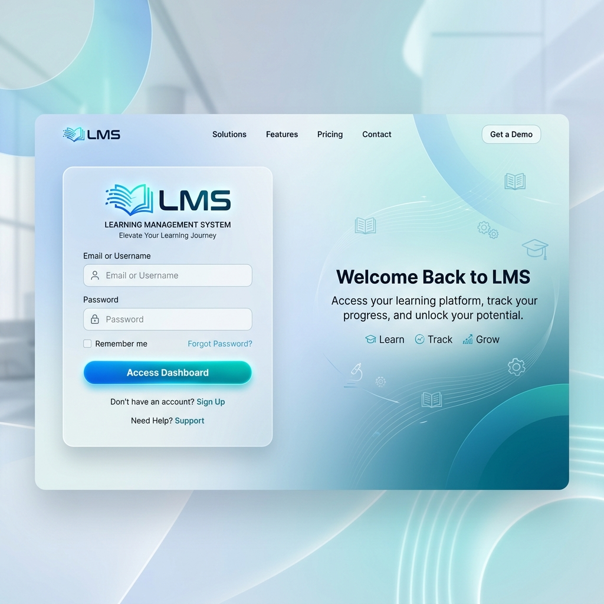
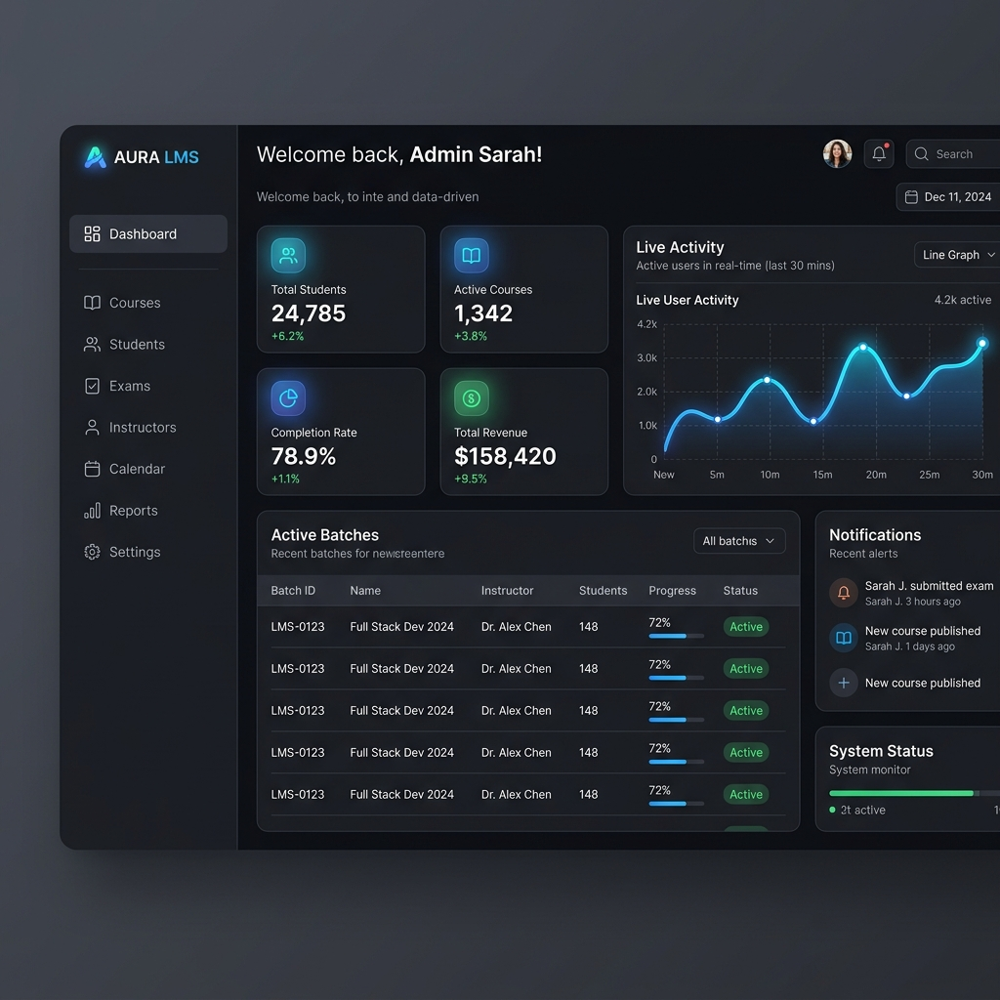
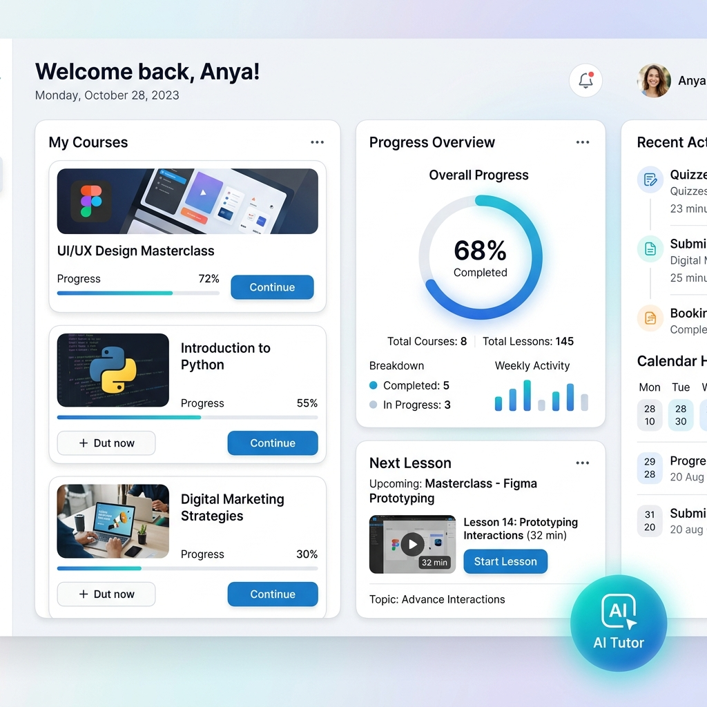

# 🚀 Premium Learning Management System (LMS) with AI Integration

Welcome to the future of education! This **LMS** is a high-fidelity, professional-grade platform designed for seamless learning, interactive tutoring, and efficient administrative management.

---

## 🎨 System Previews

### 🔐 Secure & Professional Access

*A sleek, modern login interface designed for security and ease of use.*

---

### 👑 Admin Power Dashboard

*Complete control over batches, courses, and student progress with real-time analytics.*

---

### 🧑‍🎓 Stunning Student Experience

*A premium learning experience featuring progress tracking, curriculum navigation, and AI-powered study aids.*

---

## 🌟 Key Features

### 🛠️ Administrative Dashboards
- **Batch Management**: Organize students into batches for focused teaching.
- **Dynamic Curriculum**: Assign courses to specific batches with automatic access granting.
- **Student Analytics**: Track overall performance and course completion rates.
- **Exam Management**: Create scheduled or certification-mandatory assessments easily.
- **Automated Access Control**: Revoke access automatically when batches end or students are removed.

### 📚 Student Learning Experience
- **Strict Progression**: Ensure content mastery by requiring completion of current lessons before moving ahead.
- **Progress Visualization**: Dynamic bars showing exactly how much of the program is finished.
- **Certification Exam Gateways**: Lessons can be locked behind mandatory assessments (Certification Exams).
- **Responsive Syllabus**: A mobile-friendly syllabus drawer for easy navigation across all devices.

### 🤖 AI-Powered Intelligence (Ollama Integrated)
- **Smart Summaries**: Get instant, beginner-friendly breakdowns of any lesson with Markdown tables and actionable takeaways.
- **AI Voice Tutor**: A live, context-aware vocal tutor that listens and speaks back to you.
- **Natural Cycle Mic**: Intelligent microphone management that automatically toggles based on the tutor's speech cycle.
- **AI Quick Tasks**: One-click actions for instant quizzes, study plans, and keyword explanations.

### 🛡️ Security & Performance
- **Device Fingerprinting**: Advanced security to prevent multi-device account sharing.
- **Session Management**: Secure login and role-based access control (Admin vs. Student).
- **Fast Content Delivery**: Optimized for video lessons, downloads, and interactive resources.

---

## ⚙️ Configuration Setup

To get your LMS online, open `config.php` and update the following sections with your credentials:

### 1. Database Connection
Connect your MySQL/MariaDB database:
```php
define('DB_HOST', 'localhost'); // Your DB Host (e.g., localhost)
define('DB_USER', 'root');      // Your DB Username
define('DB_PASS', '');          // Your DB Password
define('DB_NAME', 'lms_db');    // Your DB Name
```

### 2. Email (SMTP) Setup
Required for password resets and notifications:
```php
define('SMTP_USER', 'you@gmail.com');
define('SMTP_PASS', 'your-app-password'); // Use a Google App Password
define('SMTP_FROM', 'you@gmail.com');
```

### 3. Ollama AI Integration
The core of your AI Tutor and Summarizer:
```php
define('OLLAMA_API_KEY', 'your-bearer-token');
define('OLLAMA_MODEL', 'gpt-oss:120b');
define('OLLAMA_URL', 'https://ollama.com/api/chat');
```

---

## 🛠️ Technology Stack
- **Core**: PHP 8.x, PDO (Secure DB connections)
- **Database**: MySQL/MariaDB
- **Frontend**: Vanilla CSS, JavaScript (High-performance rendering)
- **AI Engine**: Ollama (gpt-oss:120b model)
- **Speech**: Web Speech API (STT & TTS)
- **Markdown**: Marked.js

---

## 📦 Installation & Setup
1. Clone the repository to your local server (e.g., XAMPP/WAMP).
2. Configure your database details in `config.php`.
3. Set your **Ollama API Key** for AI features in `config.php`.
4. Import the provided SQL schema to your database.
5. Launch and start teaching!

---

*Built with passion for the next generation of learners.*
